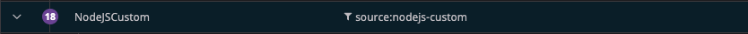
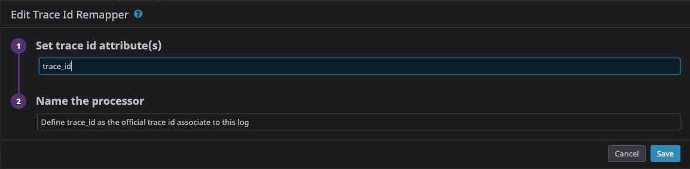
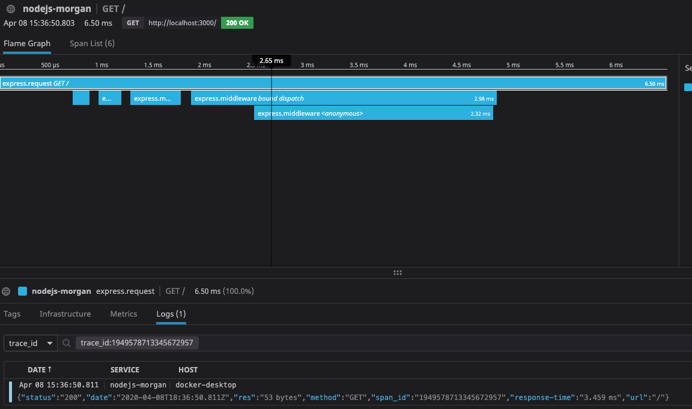

# dd-nodejs-morgan
A simple example connecting trace+log using morgan lib in node.js with Datadog

## How to use

Before to run this example, you should create a Pipeline in Datadog with a processor to remapper trace_id

Set env with your datadog key

    export DD_API_KEY=<YOUR_DD_KEY>

Run containers:

    docker-compose up -d

Do some requests in API:

    curl localhost:3000

In Datadog UI, your trace should be connected with your log:

